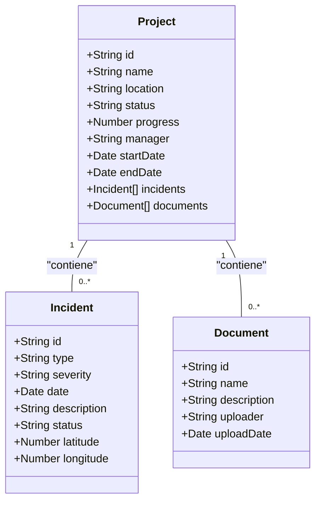

# Civisys Risk Manager

Civisys Risk Manager es una plataforma web integral diseñada para la gestión y el control de riesgos en proyectos de ingeniería civil. La aplicación proporciona herramientas visuales y analíticas para monitorear el estado de las obras, registrar incidentes, gestionar documentos y generar reportes detallados, todo desde una interfaz centralizada y moderna.


## 1. Visión del Producto

### 1.1. Problema a Resolver

La gestión de proyectos de ingeniería civil a gran escala es inherentemente compleja y está expuesta a una multitud de riesgos (geotécnicos, estructurales, climáticos, etc.). La información crítica suele estar dispersa en múltiples documentos, correos electrónicos y sistemas, lo que dificulta:
-   Tener una visión clara y en tiempo real del estado de los proyectos.
-   Identificar y correlacionar incidentes de manera eficiente.
-   Evaluar rápidamente el impacto de un riesgo en áreas geográficas específicas.
-   Generar reportes consolidados para la toma de decisiones.

### 1.2. Usuarios Principales y Valor Central

-   **Ingenieros de Campo y Jefes de Obra**: Necesitan una herramienta ágil para reportar incidentes desde el terreno, consultar documentación técnica (planos, estudios) y visualizar la ubicación exacta de los problemas.
-   **Gerentes de Proyecto y Directores**: Requieren una visión macro para monitorear el avance de múltiples obras, identificar proyectos en riesgo, analizar tendencias y generar reportes ejecutivos.
-   **Analistas SIG**: Buscan una plataforma que integre datos tabulares con una representación geoespacial para realizar análisis de proximidad, superposición de capas y mediciones.

El **valor central** de Civisys es **centralizar y visualizar la gestión de riesgos**, transformando datos complejos en información accionable a través de dashboards, mapas interactivos y reportes personalizables.

## 2. Criterios de Aceptación (Alto Nivel)

-   **Dashboard**: Muestra KPIs actualizados y gráficos interactivos sobre el estado general de los proyectos.
-   **Gestión de Obras**: Un usuario puede crear, ver, editar y eliminar una obra. La página de detalle muestra toda la información relevante, incluyendo un mapa de ubicación.
-   **Gestión de Incidentes**: Un usuario puede reportar un nuevo incidente, asociarlo a una obra y georreferenciarlo en el mapa. El estado de un incidente puede ser actualizado.
-   **Visualizador SIG**: El mapa interactivo permite cambiar entre vista de calles y satélite, activar/desactivar capas (límites, incidentes), medir distancias/áreas y realizar análisis de buffer.
-   **Reportes**: Un usuario puede filtrar datos por múltiples criterios y exportarlos a formatos PDF y CSV desde el servidor.

## ✨ 3. Funcionalidades Principales

### 3.1. Dashboard Principal
Vista centralizada con KPIs (Obras Activas, Incidentes Reportados) y gráficos interactivos sobre el avance de obras, distribución de incidentes y tendencias a lo largo del tiempo.

### 3.2. Gestión de Obras (CRUD)
Módulo para administrar proyectos, incluyendo detalles, estado, progreso, responsable y ubicación en un mapa estático.

### 3.3. Gestión de Incidentes
Formulario para reportar eventos adversos, especificando tipo, severidad y ubicación precisa. Permite el seguimiento y cambio de estado (`Reportado`, `En revisión`, `Mitigado`).

### 3.4. Gestión Documental
Sistema para cargar, visualizar y gestionar documentos (planos, informes, etc.) asociados a cada obra, con una interfaz de arrastrar y soltar.

### 3.5. Visualizador SIG (Mapa Interactivo)
Un potente mapa por obra con:
-   **Control de Capas Base**: Alternar entre OpenStreetMap (Calles) y Esri World Imagery (Satélite).
-   **Capas de Datos (Overlays)**: Activar y desactivar la visualización de los límites del proyecto y los incidentes.
-   **Simbología Personalizada**: Iconos y colores distintivos para cada tipo de incidente, con pop-ups informativos al hacer clic.
-   **Herramientas de Análisis**:
    -   **Medición**: Medir distancias (m) y áreas (m²).
    -   **Análisis de Proximidad (Buffer)**: Dibujar un círculo con un radio definido para identificar elementos dentro de un área de influencia.

### 3.6. Reportes y Exportación
Módulo para filtrar datos y generar exportaciones en formatos **PDF** y **CSV** directamente desde el servidor, asegurando consistencia y rendimiento.

## 🚀 4. Arquitectura y Tecnologías

La elección de tecnologías se centró en crear una aplicación web moderna, escalable y de alto rendimiento, utilizando un ecosistema basado en React y TypeScript.

### 4.1. Stack Tecnológico

| Capa      | Tecnología                                                              | Justificación                                                                                                                               |
| :-------- | :---------------------------------------------------------------------- | :------------------------------------------------------------------------------------------------------------------------------------------ |
| **Framework** | [Next.js](https://nextjs.org/) (App Router)                           | Renderizado del lado del servidor (SSR) para un excelente SEO y rendimiento inicial, junto con un enrutamiento moderno y flexible.           |
| **Lenguaje**  | [TypeScript](https://www.typescriptlang.org/)                         | Aporta seguridad de tipos, lo que reduce errores en tiempo de ejecución y mejora la mantenibilidad y la experiencia del desarrollador.      |
| **UI Kit**    | [Shadcn/ui](https://ui.shadcn.com/) sobre Radix UI                      | Proporciona componentes accesibles y no estilizados que son fáciles de personalizar con Tailwind, acelerando el desarrollo de la UI. |
| **Estilos**   | [Tailwind CSS](https://tailwindcss.com/)                                | Permite crear interfaces complejas y personalizadas rápidamente sin salir del HTML, manteniendo un sistema de diseño coherente.         |
| **Formularios** | [React Hook Form](https://react-hook-form.com/) + [Zod](https://zod.dev/) | Para una gestión de formularios performante y una validación de esquemas robusta tanto en el cliente como en el servidor.             |
| **Mapas**     | [Leaflet](https://leafletjs.com/) + [React-Leaflet](https://react-leaflet.js.org/) | Una librería de mapas de código abierto, ligera y potente, con un ecosistema de plugins maduro (ej. `leaflet-measure`).               |
| **Gráficos**  | [Recharts](https://recharts.org/)                                     | Componentes de gráficos componibles y sencillos para React, ideales para visualizar datos en el dashboard y los reportes.             |
| **Iconos**    | [Lucide React](https://lucide.dev/)                                   | Un set de iconos limpio, consistente y altamente personalizable.                                                                          |
| **PDF Server**| [Puppeteer](https://pptr.dev/)                                        | Para la generación de reportes PDF de alta fidelidad en el servidor, renderizando una plantilla HTML en un navegador headless.          |

### 4.2. Estructura del Proyecto
```
src/
├── app/                  # Rutas principales de la aplicación (App Router)
│   ├── api/              # Endpoints de la API (ej. para exportación)
│   ├── (rutas)/          # Páginas como /dashboard, /obras, /incidentes, etc.
│   ├── globals.css       # Estilos globales y variables de tema.
│   └── layout.tsx        # Layout principal de la aplicación.
├── components/           # Componentes de React reutilizables
│   ├── ui/               # Componentes base de Shadcn/ui.
│   └── *.tsx             # Componentes específicos de la aplicación (AppShell, etc.).
├── lib/                  # Librerías auxiliares, tipos y datos
│   ├── data.ts           # Datos iniciales y mockups.
│   ├── types.ts          # Definiciones de tipos de TypeScript.
│   └── utils.ts          # Funciones de utilidad.
├── hooks/                # Hooks de React personalizados.
└── public/               # Archivos estáticos.
```

## 🛠️ 5. Estándares y Prácticas de Código

-   **Nomenclatura**:
    -   Componentes: `PascalCase` (ej. `ProjectFormDialog`).
    -   Variables y Funciones: `camelCase` (ej. `handleProjectCreated`).
    -   Tipos e Interfaces: `PascalCase` (ej. `type Project = { ... }`).
    -   Archivos de componentes: `kebab-case` (ej. `app-shell.tsx`).
-   **Componentes**: Se prioriza la creación de componentes pequeños y reutilizables. Los componentes complejos se dividen en sub-componentes más manejables.
-   **Manejo de Estado**: El estado local se gestiona con los hooks de React (`useState`, `useEffect`). Para el estado global simple (como el tema), se utiliza `localStorage` y `Context`.
-   **Estilos**: Se utilizan las utilidades de Tailwind CSS directamente en el JSX. Se evita el CSS personalizado en la medida de lo posible, centralizando las variables de tema en `globals.css`.
-   **Tipado**: Se utiliza TypeScript de forma estricta. Todos los tipos para las entidades de datos principales (Project, Incident) están centralizados en `src/lib/types.ts`.

##  UML: Diagrama de Entidades

A continuación, se muestra un diagrama simplificado de las principales entidades de datos y sus relaciones.



## 🏁 6. Cómo Empezar

1.  **Instalar dependencias:**
    ```bash
    npm install
    ```

2.  **Ejecutar el servidor de desarrollo:**
    ```bash
    npm run dev
    ```

3.  Abre [http://localhost:9002](http://localhost:9002) en tu navegador para ver la aplicación en funcionamiento.

